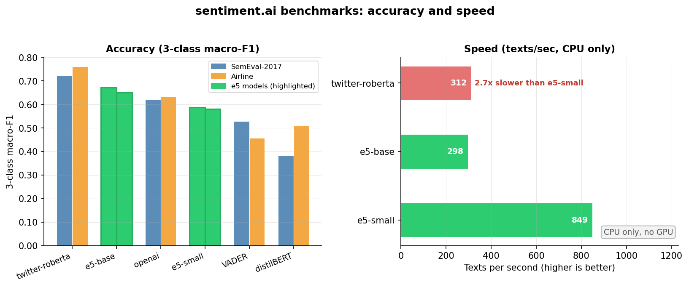

<script>
  $(document).ready(function() {
    $('#TOC').parent().prepend('<div id=\"nav_logo\"></div>');
  });
</script>

```{css, echo=FALSE}
 #TOC::before {
  font-size: 32px;
  font-weight: 900;
  text-align: center;
  content: "sentiment.ai";
  display: block;
  width: 200px;
  height: 80px;
  line-height: 80px;
  margin: 10px 10px 10px 20px;
  background-size: contain;
  background-position: center center;
  background-repeat: no-repeat;
}
#TOC{
    border:none;
}
.new-in-v2 {
  background: #f0f7ff;
  border-left: 4px solid #2c7bb6;
  padding: 12px 16px;
  border-radius: 4px;
  margin: 16px 0;
}
```

```{r setup, include=FALSE}
knitr::opts_chunk$set(echo = TRUE)
```

<!-- [START BADGES] -->
<p align="left">
  <a href="https://CRAN.R-project.org/package=sentiment.ai"></a>
  <a href="https://CRAN.R-project.org/package=sentiment.ai"></a>
  <a hidden href="https://hits.seeyoufarm.com"></a>
</p>
<!-- [END BADGES] -->

# Overview

`sentiment.ai` turns text into sentiment scores using a sentence-embedding model plus
a small, bundled scoring head. The default backend is the on-device multilingual model
**`multilingual-e5-base`** (**no TensorFlow, no API key, no data leaving your machine**).

<div class="new-in-v2">
**The most complete on-device sentiment toolkit in the R/Python ecosystem,** tiny by
default, with hate / mixed / style flags, intent-based profiles, an interactive map, and
opt-in transformer backends for when you want maximum accuracy.

On-device `e5-base` **matches the paid OpenAI embedding** (`text-embedding-3-small`) on our
benchmarks. On general business text (employee reviews, macro-F1, n = 10,085) the on-device
`e5-base` default lands within about two points of both the paid OpenAI embedding and a 125M
fine-tuned transformer, and sits 20 to 30 points above lexicon tools. The fine-tuned
transformers open a clear gap only on tweets (their training domain), so rather than overclaim
we **ship them as the opt-in `max-english` / `max-multilingual` backends**. All benchmarks run
locally (no API calls, no data sent anywhere). See [Benchmarks](#benchmarks) for the full,
honest tables.
</div>

<div class="new-in-v2">
**What's new in v2 (1.1.0)**

- **Sentiment map:** `plot_sentiment()` embeds your corpus, projects it to 2-D, colours each point by sentiment, and auto-labels the clusters (interactive; hover for the full text).
- **Safety & style flags:** `sentiment()` adds `hate_speech` / `p_hate` (AUROC ≈ 0.95-0.97), `mixed`, and `style` from the *same* embedding (e5 models; no extra download).
- **Profiles:** `use_profile()` / `setup()`: pick a backend by intent (`lightest` / `multilingual` / `max-english` / `max-multilingual`) and it persists across sessions.
- **Transformer backends:** opt-in `model = "twitter-roberta"` / `"xlm-roberta"` for max in-domain accuracy, rather than overclaim we ship them as opt-in backends.
- Still: no TensorFlow, calibrated confidence (ECE ≈ 0.015), tidy 3-class `sentiment()`, `sentiment_diagnostics()`, `sentiment_agreement()`.
- A **Python sibling** (`sentimentai`) shares the same scoring heads, verified bit-for-bit.
</div>


Compared with lexicon/dictionary methods:

1. **More robust:** handles spelling mistakes, mixed case, and ~100 languages from one model.
2. **No rigid lexicon:** text becomes an embedding vector, so novel phrasing and domain jargon are handled naturally.
3. **Tunable context:** `sentiment_match()` lets you define what *positive* and *negative* mean for your domain.
4. **Auditable:** scoring is deterministic; `sentiment_provenance()` reports the exact model, revision SHA, and scoring head behind every score.

---

# Getting started {.tabset .tabset-fade .tabset-pills}

## R users

```{r r-quickstart, echo=TRUE, eval=FALSE}
install.packages("sentiment.ai")        # from CRAN
library(sentiment.ai)

# one-time setup - walks you through it interactively
install_sentiment.ai()

# the model loads on first use - no explicit init() needed
sentiment_score(c("I love this!", "this is terrible"))
#> [1]  1.00 -1.00

# full 3-class tidy output
sentiment(c("I love this!", "The package arrived on Tuesday afternoon.", "this is terrible"))
#>                                        text sentiment    class confidence
#> 1                              I love this!      1.00 positive       1.00
#> 2 The package arrived on Tuesday afternoon.      0.00  neutral       0.99
#> 3                          this is terrible     -1.00 negative       1.00
```

`init_sentiment.ai()` is optional, only needed for eager loading (e.g. to avoid a
slow first call inside a benchmark loop). The model loads automatically on the first
`sentiment_score()` / `sentiment()` / `sentiment_match()` call.

**Persistent model default:**
```{r r-default-model, echo=TRUE, eval=FALSE}
# In your .Rprofile - picks up at every library(sentiment.ai)
options(sentiment.ai.model = "e5-base")
```

## Python users

```bash
pip install --pre sentimentai-py
```

```python
import sentimentai as sa

# simple score: one score per input, in input order
sa.sentiment_score(["I love this!", "this is terrible"])
# array([ 1.  , -1.  ])   # about +1 = positive, about -1 = negative

# tidy output: a list of dicts (text, prob_neg/neu/pos, class, confidence, + hate/mixed/
# style flags for e5 models). Wrap in a DataFrame for a table:
import pandas as pd
pd.DataFrame(sa.sentiment(["I love this!", "The package arrived on Tuesday afternoon.", "this is terrible"]))[["text", "sentiment", "class", "confidence"]]
#                                         text  sentiment     class  confidence
# 0                              I love this!       1.00  positive        1.00
# 1  The package arrived on Tuesday afternoon.       0.00   neutral        0.99
# 2                          this is terrible      -1.00  negative        1.00

# same scoring heads as the R package - the forward pass is verified bit-for-bit
sa.resolve("e5-small")   # the backend: hf id, dim, kind, pinned revision
```

Install options:
```bash
pip install --pre sentimentai-py                  # CPU (default)
pip install --pre sentimentai-py[openai]          # + OpenAI API support
```

---

# A quick taste

Some real scores from the default model. It reads context, not just keywords:

| text | `sentiment.ai` |
|:-----|:--------------:|
| the resturant is my favorite! | **+0.96** |
| this restront is my FAVRIT innit! | **+0.46** |
| I love watching scary horror movies | **+0.88** |
| I had **a blast** on my trip to Nagasaki | **+0.24** |
| **The blast** in Nagasaki | **−0.99** |
| my absolute favorite until they gave me food poisoning | **−0.96** |
| What a great car. It stopped working after a week. | **−0.52** |

(Default `e5-base`. Note "**a blast** on my trip" vs "**The blast** in Nagasaki".
Scoring is deterministic; `sentiment_provenance()` logs exactly what produced each score.)

---

# Why not just use tidytext / vader / sentimentr?

Lexicon-based tools score words against a fixed dictionary. They are fast and easy to
inspect, but share hard limits: out-of-vocabulary terms are missed, negation is handled
only by hand-written rules, and most convenient lexicons are English-only.
`sentiment.ai` maps the whole sentence to an embedding vector and classifies that vector:

- **Handles ~100 languages** with one model, no separate multilingual lexicons.
- **Scores phrases no dictionary has ever seen:** slang, domain jargon, product names.
- **Explicit neutral class:** not just "not positive, not negative".
- **Calibrated confidence** (ECE ≈ 0.015) so you can triage on it.
- **Tunable context:** redefine positive/negative for your domain.

The tradeoff is setup time: lexicon tools install with no Python; `sentiment.ai` needs
a one-time ~280 MB model download. After that there is no internet connection required
and scoring is deterministic across machines.

---

# Picking a model {.tabset .tabset-fade .tabset-pills}

## e5-small (lighter option)

| property | value |
|:---------|:------|
| Embedding dim | 384 |
| Disk / RAM | ~120 MB |
| Languages | ~100 |
| Speed | ~850 texts/sec (CPU) |
| Macro-F1 | 0.836 (general business text, employee reviews, n=10,085) |

**Best for:** scripts and pipelines where throughput matters, laptops with < 8 GB RAM,
short text (tweets, survey items, review snippets), exploratory work and fast iteration.

```{r e5small, echo=TRUE, eval=FALSE}
sentiment_score(texts, model="e5-small")  # explicit: lighter/faster option
```

## e5-base (default)

| property | value |
|:---------|:------|
| Embedding dim | 768 |
| Disk / RAM | ~280 MB |
| Languages | ~100 |
| Speed | ~300 texts/sec (CPU) |
| Macro-F1 | 0.888 (general business text, employee reviews, n=10,085) |

**Best for:** final datasets for publication, longer/more nuanced text (interview transcripts,
open-ended verbatims), servers with ample RAM, cases where the ~5 pp F1 gain over e5-small matters.

```{r e5base, echo=TRUE, eval=FALSE}
sentiment_score(texts, model = "e5-base")

# make e5-base your session default
init_sentiment.ai(model = "e5-base")

# or permanent (in .Rprofile):
options(sentiment.ai.model = "e5-base")
```

## OpenAI API

| property | value |
|:---------|:------|
| Embedding dim | 1536 |
| Model | `text-embedding-3-small` |
| Speed | network-dependent |
| Macro-F1 | 0.896 (general business text, employee reviews, n=10,085) |
| Cost | per-token API charge |

Text leaves your machine and is sent to OpenAI's servers. Requires an API key.

```{r openai, echo=TRUE, eval=FALSE}
Sys.setenv(OPENAI_API_KEY = "sk-...")
sentiment_score(texts, model = "openai")
```

---

# Sentiment analysis: R {.tabset .tabset-fade .tabset-pills}

## `sentiment_score()`

One score per input in `[-1, 1]`.

```{r score, echo=TRUE, eval=FALSE}
sentiment_score(c("Will you marry me?", "Oh, you're breaking up with me..."))
#> [1]  0.54 -0.66
```

## `sentiment()`

Tidy data frame with the full 3-class signal. Use when the neutral mass matters or to
triage low-confidence rows.

```{r tidy, echo=TRUE, eval=FALSE}
sentiment(c("I love this!", "The package arrived on Tuesday afternoon.", "this is terrible"))
#>                                        text sentiment prob_neg prob_neu prob_pos    class confidence
#> 1                              I love this!      1.00     0.00     0.00     1.00 positive       1.00
#> 2 The package arrived on Tuesday afternoon.      0.00     0.00     0.99     0.00  neutral       0.99
#> 3                          this is terrible     -1.00     1.00     0.00     0.00 negative       1.00

# triage: trust high-confidence rows automatically
s    <- sentiment(my_reviews)
sure <- s[s$confidence >= 0.85, ]   # auto-accept
flag <- s[s$confidence <  0.85, ]   # route to human
```

## `sentiment_match()`

Same calibrated score as `sentiment_score()`, plus a nearest-phrase explanation against
**tunable poles**. The poles define what *positive* and *negative* mean for your domain.

```{r match, echo=TRUE, eval=FALSE}
sentiment_match(c("Will you marry me?", "Oh, you're breaking up with me..."),
                phrases = list(
                  positive = c("excited", "loving", "content", "happy"),
                  negative = c("lame",    "lonely", "sad",     "angry")))
#>                                text sentiment phrase    class similarity
#> 1                Will you marry me?      0.54 loving positive       0.82
#> 2 Oh, you're breaking up with me...     -0.66    sad negative       0.79
```

Omit `phrases` to use the bundled balanced 40/40 default poles.

## `sentiment_provenance()`

See exactly what produced a score.

```{r prov, echo=TRUE, eval=FALSE}
sentiment_provenance("e5-small")
#> sentiment.ai provenance
#>   model    : e5-small (st, dim 384)
#>   prefix   : ""
#>   revision : 614241f622f53c4eeff9890bdc4f31cfecc418b3
#>   license  : MIT
#>   source   : https://huggingface.co/intfloat/multilingual-e5-small
#>   scoring  : mlp 2.0 (mlp, T=1)
```

---

# Sentiment analysis: Python {.tabset .tabset-fade .tabset-pills}

## `sentiment_score()`

```python
import sentimentai as sa
scores = sa.sentiment_score(["I love this!", "this is terrible"])
# array([1.  , -1.  ])
```

## `sentiment()`

```python
rows = sa.sentiment(["I love this!", "The package arrived on Tuesday afternoon.", "this is terrible"])
# a list of dicts (text, sentiment, prob_neg/neu/pos, class, confidence, + hate/mixed/style
# flags for e5 models). Wrap in pandas.DataFrame(rows) for a table.
rows[1]
# {'text': 'The package arrived on Tuesday afternoon.', 'sentiment': 0.00,
#  'class': 'neutral', 'confidence': 0.99, 'hate_speech': False, 'mixed': False, 'style': 'informal', ...}
```

## `sentiment_match()`

```python
poles = {
    "positive": ["friendly", "on time", "helpful"],
    "negative": ["rude",     "delayed", "lost luggage"],
}
rows = sa.sentiment_match(["The cabin crew were friendly and helpful",
                           "My bag was lost and nobody helped"], phrases=poles)
# [{'text': '...friendly...', 'sentiment': 0.30, 'phrase': 'friendly',
#   'class': 'positive', 'similarity': 0.84}, ...]
```

## `sentiment_provenance()`

```python
sa.sentiment_provenance("e5-small")
# {'model': 'e5-small', 'backend': 'sentence-transformers', 'dim': 384,
#  'prefix': '', 'revision': '614241f622f53c4eeff9890bdc4f31cfecc418b3',
#  'scoring': 'mlp', 'scoring_version': '2.0', 'head_type': 'mlp',
#  'temperature': 1.0}
```

---

# Calibration: how much to trust a score

`sentiment.ai` doesn't just pick a class. Its probabilities are **calibrated**, so the
`confidence` from `sentiment()` means what it says: among rows scored at 0.8 confidence,
about 80% really are that class.

On the held-out test set the **expected calibration error (ECE) is about 0.015**
(`e5-small`) / **0.017** (`e5-base`), well-calibrated (an uncalibrated model is typically
0.05-0.15):

| stated confidence (e5-small) | actually correct |
|---:|---:|
| ~0.55 | 53% |
| ~0.70 | 73% |
| ~0.84 | 81% |
| ~0.90 | 92% |
| ~0.98 | 99% |

Calibration was measured in-domain (reviews / short verbatims, single split). Treat very
different text (legal documents, code, heavy sarcasm) with more caution.

---

# Diagnostics: when not to trust a score

`sentiment_diagnostics()` augments every row with signals that say *when not to trust it*:

| column | meaning |
|:-------|:--------|
| `entropy` | Shannon entropy of the 3-class probs (nats). High = head is uncertain. |
| `confidence_band` | Ordered factor `"low"` / `"moderate"` / `"high"` calibrated from ECE data. |
| `mixed` | `TRUE` when both `prob_pos` and `prob_neg` > 0.25 (competing signals). |
| `ood_similarity` | Cosine to training centroids. Low (~< 0.20) = unlike training data. |
| `ood_flag` | `TRUE` when `ood_similarity < 0.20` (probably out-of-domain). |

```{r diag-r, echo=TRUE, eval=FALSE}
d <- sentiment_diagnostics(c(
  "I absolutely loved everything about this trip!",
  "Ein sehr ungewoehnlicher Text auf Deutsch.",      # German - in-domain (e5 is multilingual)
  "0x4A 0x6F 0x65",                                 # hex bytes - out-of-domain
  "The food was great but the service was terrible." # mixed signal
))
d[, c("text", "sentiment", "confidence_band", "mixed", "ood_flag")]
```

**Auto-accept triage rule:**
```{r triage, echo=TRUE, eval=FALSE}
auto_accept <- d$confidence_band >= "moderate" & !d$mixed &
               !is.na(d$ood_flag) & !d$ood_flag
# TRUE rows: route to auto-pipeline
# FALSE rows: send to human review
```

`confidence_band` is an ordered factor (`low < moderate < high`), so `>=` comparisons work naturally.

---

# Validating against human labels

`sentiment_agreement()` compares model scores to human-provided labels and returns the
statistics needed for a methods section.

```{r agree-r, echo=TRUE, eval=FALSE}
data(airline_tweets)
scores <- sentiment_score(airline_tweets$text)
ag     <- sentiment_agreement(scores, airline_tweets$airline_sentiment)
print(ag)
#> sentiment.ai agreement statistics  (n = 14640)
#> -----------------------------------------------
#>   Spearman r (score vs label)  : 0.561
#>   Percent agreement (3-class)  : 57.4%
#>   Weighted kappa (quad, 3-cls) : 0.506
#>
#> Human-human ceiling (indicative): weighted kappa ~0.50-0.65 on
#> GoEmotions / SemEval-2017-4.
#>   Krippendorff alpha (ordinal) : 0.442
#>   ICC(2,1)                     : 0.510   95% CI [0.316, 0.639]
#>
#> Confusion matrix (rows=true, cols=predicted):
#>           predicted
#> true       negative neutral positive
#>   negative     4698    3752      728
#>   neutral       435    2023      641
#>   positive      126     551     1686
```

A **weighted kappa of 0.51** is consistent with the typical human-human ceiling on 3-class
sentiment (0.50-0.65). This is the number to quote in a methods section.

Adjust the neutral-zone boundaries to match your application:
```{r agree-thresh, echo=TRUE, eval=FALSE}
ag2 <- sentiment_agreement(scores, labels,
                           positive_threshold =  0.2,
                           negative_threshold = -0.2)
```

---

# All modes at a glance

| mode | `model=` | requires | embed dim | model download | storage / 1M texts |
|:-----|:---------|:---------|----------:|--------------:|-------------------:|
| **on-device, lighter** | `"e5-small"` | PyTorch CPU | 384 | ~120 MB | ~1.5 GB |
| **on-device default** | `"e5-base"` | PyTorch CPU | 768 | ~280 MB | ~3.0 GB |
| **API** | `"openai"` | API key + internet | 1536 | none | ~6.0 GB |
| **legacy** | `"en"` / `"en.large"` / `"multi"` | TensorFlow | 512 | varies | ~2.0 GB |

The `mlp`/`logistic` scoring heads ship inside the package for the two on-device modes,
no additional download. Storage figures are raw float32; `saveRDS(..., compress="xz")` cuts
this roughly 3-4× in practice.

---

# Benchmarks {.tabset .tabset-fade .tabset-pills}

Most people scoring sentiment are scoring reviews, tickets, and survey text, not tweets,
so we lead with general business text. All benchmarks run locally on public data, no
proprietary data.



## General business text

**Employee reviews, macro-F1, n = 10,085:**

| model | macro-F1 |
|:------|:--------:|
| `twitter-roberta` (opt-in transformer) | 0.909 |
| `openai` (paid embedding) | 0.896 |
| **`e5-base` (default, on-device)** | **0.888** |
| distilBERT-SST2 | 0.879 |
| `e5-small` (on-device) | 0.836 |
| VADER | 0.681 |
| TextBlob | 0.626 |

On real business text the on-device `e5-base` default lands within about two points of
both the paid OpenAI embedding and a 125M fine-tuned transformer, clears distilBERT, and
sits 20 to 30 points above the lexicon tools. On a separate held-out set of general review
text (n = 19,547) the on-device heads reach macro-F1 0.93 (`e5-base`) and 0.94 (`e5-small`).

## Tweets (transformer caveat)

The fine-tuned `twitter-roberta` opens a real gap on Twitter benchmarks because tweets are
its training data. This is the one domain where opting into the transformer backend pays off:

| model | SemEval-2017 tweets | Airline tweets |
|:------|:-------------------:|:--------------:|
| `twitter-roberta` (opt-in) | 0.724 | 0.761 |
| `e5-base` (default) | 0.672 | 0.651 |
| `e5-small` | 0.587 | 0.581 |
| VADER | 0.529 | 0.457 |

If your text really is tweets, opt into the `max-english` backend. For everything else the
gap is small, and `e5-base` is the only option here that also covers ~100 languages, carries
the hate / mixed / style flags, gives you `sentiment_match()` and `plot_sentiment()`, keeps
data on the machine, and stays free.

## Speed

**CPU throughput, R package (texts/sec, higher is better):**

| method | texts/sec | type |
|:-------|----------:|:-----|
| tidytext (bing) | **32,258** | pure R, dictionary lookup |
| syuzhet (AFINN) | 3,311 | pure R, word-score sum |
| sentimentr | 564 | R + C++, sentence-aware |
| **sentiment.ai e5-small** | **~850** | neural, CPU, MLP head |
| **sentiment.ai e5-base** (default) | **~300** | neural, CPU, 768-d |
| sentiment.ai twitter-roberta (opt-in) | ~310 | fine-tuned transformer, CPU |
| sentiment.ai openai | ~300-600 | API, rate-limited |

The opt-in transformer runs at about the same speed as `e5-base` on CPU. `e5-small` is
the fastest on-device neural option.

**Python (sentimentai-py) throughput:**

| method | texts/sec |
|:-------|----------:|
| vaderSentiment | **4,875** |
| TextBlob | 4,182 |
| **sentimentai-py e5-small** | **~850** |
| **sentimentai-py e5-base** (default) | **~300** |
| HF twitter-roberta | ~310 |

## Multilingual

Corpus: 892 GPT-4o-mini synthetic examples (50 per class per language); macOS aarch64 CPU.
*vader and roberta are English-only; non-English scores are shown to illustrate their limits.*

| method | overall | english | spanish | french | german | portuguese | arabic |
|:-------|:-------:|:-------:|:-------:|:------:|:------:|:----------:|:------:|
| **sentimentai e5-base** | **0.827** | **0.890** | **0.926** | **0.868** | **0.870** | 0.560 | **0.791** |
| sentimentai e5-small | 0.761 | 0.865 | 0.787 | 0.784 | 0.747 | 0.570 | 0.766 |
| vader | 0.432 | 0.710 | 0.484 | 0.322 | 0.291 | 0.271 | 0.457 |
| twitter-roberta | N/A | 0.837 | *N/A* | *N/A* | *N/A* | *N/A* | *N/A* |

On English, e5-base (0.890) edges roberta (0.837). On every other language, roberta and vader
cannot compete. vader collapses to F1=0.271 on German (roughly chance-level on 3-class).

**Portuguese note:** both e5 models score ~0.56 on Portuguese, a genuine gap worth
acknowledging. Possible causes: Portuguese underrepresentation in the e5 training mix, or
synthetic corpus artefacts. Use `e5-base` for Portuguese but validate on your own data.

*Corpus note:* synthetic text generated by GPT-4o-mini tends to be cleaner and less ambiguous
than real-world text. Absolute F1 figures are optimistic vs messy real text; the relative
ordering across languages and methods is the reliable signal.

## When to use each

| | e5-small | e5-base (default) | twitter-roberta | vaderSentiment |
|:--|:--:|:--:|:--:|:--:|
| General text macro-F1 | 0.836 | **0.888** | 0.909 | 0.681 |
| Tweets macro-F1 | 0.587 | 0.672 | **0.724** | 0.529 |
| Multilingual (6 lang) | **✓** | **✓** | ✗ English only | ✗ English only |
| Calibrated confidence | **✓** | **✓** | ✗ | ✗ |
| Tunable poles | **✓** | **✓** | ✗ | ✗ |
| Hate / mixed / style flags | **✓** | **✓** | ✗ | ✗ |
| Speed (CPU, texts/sec) | ~850 | ~300 | ~310 | ~5,000 |
| No download | ✗ | ✗ | ✗ (~500 MB) | **✓** |
| No API cost | **✓** | **✓** | **✓** | **✓** |

---

# Installation & setup {.tabset .tabset-fade .tabset-pills}

## R

```{r r-install, echo=TRUE, eval=FALSE}
install.packages("sentiment.ai")   # from CRAN
library(sentiment.ai)

# one-time setup - the interactive wizard walks you through it,
# including choosing e5-small vs e5-base as your default model
install_sentiment.ai()
```

**Key arguments:**

| argument | default | effect |
|:---------|:-------:|:-------|
| `method` | `"auto"` | `"virtualenv"` or `"conda"` |
| `gpu` | `FALSE` | `TRUE` = CUDA build (Linux/Windows with NVIDIA GPU) |
| `pin_versions` | `NA` | `NA` = try latest, auto-fallback to verified baseline on failure; `TRUE` = always use pinned; `FALSE` = skip check |
| `legacy` | `FALSE` | `TRUE` = also install TensorFlow / USE legacy stack |
| `fast` | `NA` | uses `uv` if on PATH for a much faster install |

**Troubleshooting (most common fix):**
```{r r-troubleshoot, echo=TRUE, eval=FALSE}
# Check if RETICULATE_PYTHON is pointing at the wrong interpreter
Sys.getenv("RETICULATE_PYTHON")

# If set, clear it and restart R
Sys.unsetenv("RETICULATE_PYTHON")
# then restart R and re-run install_sentiment.ai()
```

In RStudio: *Tools > Global Options > Python > Select* and point it at the
`r-sentiment-ai` virtualenv.

## Python

```bash
pip install --pre sentimentai-py
```

```python
import sentimentai as sa

# first use triggers a ~280 MB model download (one-time)
sa.sentiment_score(["Hello world"])

# to use the larger, more accurate model, just pass model= (no init step needed);
# sa.ensure_model("e5-base") pre-downloads it if you want to control when:
sa.sentiment_score(["Hello world"], model="e5-base")
```

Requirements: Python 3.9+, PyTorch (CPU or CUDA).

---

# Embeddings & matrix helpers

Embed text yourself with `embed_text()` and compare with `cosine()` / `cosine_match()`:

```{r matrix, echo=TRUE, eval=FALSE}
target_mx <- embed_text(c("dogs", "cat", "keyboard", "mouse"))
ref_mx    <- embed_text(c("animals", "technology"))

cosine_match(target_mx, ref_mx)[rank == 1]
#>     target  reference similarity rank
#> 1:    dogs    animals       0.93    1
#> 2:     cat    animals       0.90    1
#> 3: keyboard technology       0.87    1
#> 4:   mouse    animals       0.89    1

# approx=TRUE for large reference sets (requires RANN; much faster)
cosine_match(target_mx, large_ref_mx, approx = TRUE)
```

---

# Contribute a scoring head

Heads live under `inst/scoring/<type>/<version>/<model>.json`. A head is a small JSON
describing the forward pass (`{type, dim, T, layers | coef, classes}`), evaluated by a
pure-R scorer (no xgboost or TensorFlow at score time).

Use `head_path =` on `sentiment_score()` / `sentiment()` / `sentiment_diagnostics()` to
load a custom or domain-retrained head without touching the installed package:

```{r custom-head, echo=TRUE, eval=FALSE}
# point directly at a custom JSON head
sentiment_score(texts, head_path = "~/my_domain_head.json")
sentiment_diagnostics(texts, head_path = "~/my_domain_head.json")
```

---

<br><hr><br>

Originally created by the [Korn Ferry Institute](https://www.kornferry.com/institute) AITMI team. MIT licensed.
