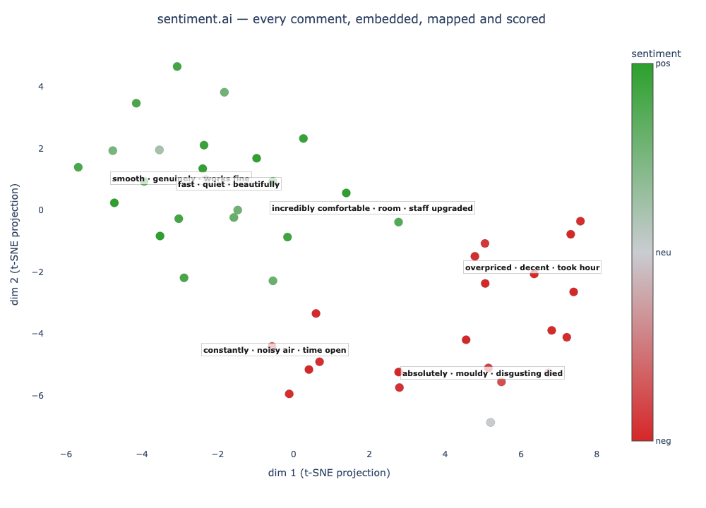

# sentiment.ai

Sentiment analysis from sentence embeddings: multilingual, on-device, and
**TensorFlow-free** by default.

**Project page:**
[https://benwiseman.github.io/sentiment.ai/](https://benwiseman.github.io/sentiment.ai/)

> **v2 note.** The default backend is now the on-device multilingual model
> `multilingual-e5-base` (no TensorFlow, no API key). The legacy Universal
> Sentence Encoder models still work but are opt-in (`install_sentiment.ai(legacy = TRUE)`).
> A Python sibling, [`sentimentai-py`](https://pypi.org/project/sentimentai-py/),
> shares the same scoring heads.

# Quick start

```r
install.packages("sentiment.ai")        # from CRAN
library(sentiment.ai)

# one-time setup of the (TensorFlow-free) Python backend
install_sentiment.ai()

# load the default model (multilingual e5-base), then score some text
init_sentiment.ai(model = "e5-base")
sentiment_score(c("I love this!", "this is terrible"))
#> [1]  1.00 -1.00   (about 1 = positive, about -1 = negative)
```

That's it: no TensorFlow, no API key, and the model runs on your machine.

# New in v2



**Map a whole corpus** with `plot_sentiment()`: every comment embedded, projected to
2-D, coloured by sentiment, full text on hover, and **human-readable cluster labels**
(deterministic c-TF-IDF, or `labels = "openai"` for tidier topics at ~a cent):

```r
p <- plot_sentiment(airline_tweets$text)     # interactive plotly widget
htmlwidgets::saveWidget(p, "map.html")
```

**Safety & style flags.** For the on-device e5 models, `sentiment()` adds
`hate_speech` / `p_hate` (hate detector, AUROC ≈ 0.95-0.97), `mixed` (competing
pos/neg signal), and `style` (analytical / descriptive / formal / informal / inquisitive),
all from the same embedding, no extra download.

**Profiles.** Pick a backend by intent instead of memorising model names; the choice
persists across sessions:

```r
sentiment_profiles()           # lightest / multilingual / max-english / max-multilingual
use_profile("multilingual")    # e5-base, with flags
use_profile("max-english")     # opt-in RoBERTa (sentiment only)
```

Fine-tuned transformers lead *in-domain* accuracy, so rather than overclaim we ship them as opt-in end-to-end backends behind the same API: `model = "twitter-roberta"`
(English) and `model = "xlm-roberta"` (multilingual). The default stays tiny, on-device,
and TF-free.

# Overview

`sentiment.ai` turns text into a sentiment score by (1) embedding the text with a
sentence-embedding model and (2) running a small, bundled scoring head over that
embedding. Compared with traditional lexicon/dictionary methods this:

1. **Is more robust:** it tolerates spelling mistakes and mixed case, and the
   default model handles **~100 languages**.

2. **Doesn't need a rigid lexicon:** text is reduced to an embedding vector, so you
   get sensible scores for words and phrasings that aren't in any dictionary.

3. **Lets you choose the context:** with `sentiment_match()` you define what
   *positive* and *negative* mean for your domain (e.g. `"high quality"` vs
   `"low quality"` for product reviews).

4. **Is auditable:** scoring is deterministic, and `sentiment_provenance()` reports
   exactly which model, scoring head, and settings produced a score.

# Models

Pick a model with `init_sentiment.ai(model = ...)` (and `sentiment_score(model = ...)`):

| `model`        | dim  | notes                                                            |
|:---------------|:----:|:-----------------------------------------------------------------|
| `e5-small`     | 384  | lighter/faster option, ~100 languages, on-device, no TensorFlow  |
| `e5-base`      | 768  | **default**, best on-device quality, ~100 languages, no TensorFlow |
| `openai`       | 1536 | `text-embedding-3-small` (paid API, text leaves your machine)    |
| `twitter-roberta` | - | opt-in end-to-end English RoBERTa, max in-domain accuracy (~500 MB) |
| `xlm-roberta`  |  -   | opt-in end-to-end multilingual XLM-R, max accuracy (~1 GB)       |
| `en` / `en.large` / `multi` / `multi.large` | 512 | legacy Universal Sentence Encoder (**opt-in, requires TensorFlow**) (`install_sentiment.ai(legacy = TRUE)`) |

The scoring head is chosen with `scoring`: `"mlp"` (default) or `"logistic"`. Both are
small, pure-R JSON heads bundled with the package (**no xgboost and no TensorFlow at
score time**).

# Installation & setup

After installing the package from CRAN, set up the Python backend once:

```r
install_sentiment.ai()           # TensorFlow-free default (sentence-transformers + e5)
```

This creates a Python virtual/conda environment (default name `"r-sentiment-ai"`) and
installs the on-device embedder. Useful arguments:

* `envname`: name of the Python environment.
* `method`: `"auto"` (default), `"virtualenv"`, or `"conda"`.
* `legacy`: `FALSE` (default) installs the TensorFlow-free stack. Set `TRUE` to also
  install TensorFlow / TF-Hub for the legacy Universal Sentence Encoder models.
* `gpu`: only relevant when `legacy = TRUE` (the default e5 backend uses PyTorch,
  which picks its own device).

```r
# opt into the legacy Universal Sentence Encoder models (installs TensorFlow):
# install_sentiment.ai(legacy = TRUE)
```

Because this bridges R and Python via `reticulate`, see **Troubleshooting** below if
the environment is hard to activate.

# Initialize

`init_sentiment.ai()` loads the embedding model into memory so repeated scoring is
fast. It is optional (`sentiment_score()` will call it for you), but pre-initializing
avoids re-loading the model on every call.

```r
init_sentiment.ai()                       # default model: e5-base
init_sentiment.ai(model = "e5-small")     # lighter/faster option
# init_sentiment.ai(model = "en.large")   # legacy USE (needs legacy install)
```

# Sentiment analysis

## `sentiment_score()`

The main function. Returns one score per input, rescaled to `[-1, 1]` (about `1` =
positive, about `-1` = negative).

```r
reviews <- c("The cabin crew were friendly and helpful",
             "My bag was lost and nobody helped")
sentiment_score(reviews)                # default: e5-base + mlp head
#> [1]  0.30 -0.91
```

Key arguments: `x` (text or a pre-computed embedding matrix), `model` (default
`"e5-base"`), `scoring` (`"mlp"` default, or `"logistic"`), and `batch_size`.

## `sentiment()`

The same score, but with the whole picture the head computes instead of just one number:
the per-class probabilities, a label, and a confidence. Reach for it when the neutral mass
matters, or to triage rows for review.

```r
sentiment(c("I love this!", "The package arrived on Tuesday afternoon.", "this is terrible"))
#>                                        text sentiment prob_neg prob_neu prob_pos    class confidence
#> 1                              I love this!      1.00     0.00     0.00     1.00 positive       1.00
#> 2 The package arrived on Tuesday afternoon.      0.00     0.00     0.99     0.00  neutral       0.99
#> 3                          this is terrible     -1.00     1.00     0.00     0.00 negative       1.00
```

For the e5 models, `sentiment()` also appends the post-processing flag columns
`hate_speech` / `p_hate` / `mixed` / `style` (omitted above for width).

`sentiment` is `prob_pos - prob_neg`; `class` is the most probable of negative / neutral /
positive; `confidence` is that class's probability. The probabilities are **calibrated**
(temperature-scaled): on the held-out test set the expected calibration error is ≈ 0.015,
so a stated confidence means roughly what it says. See
[`planning/reliability-report.md`](planning/reliability-report.md).

## `sentiment_match()`

The **same `sentiment` score** as `sentiment_score()`, plus a nearest-phrase
explanation against **tunable poles** (you define what the poles mean for your domain).
The poles only shape the explanation (`phrase` / `class` / `similarity`), never the score:

```r
poles <- list(positive = c("friendly", "on time", "helpful"),
              negative = c("rude", "delayed", "lost luggage"))

result <- sentiment_match(reviews, phrases = poles)
print(result)
#>                                       text sentiment       phrase    class similarity
#> 1 The cabin crew were friendly and helpful      0.30     friendly positive       0.84
#> 2        My bag was lost and nobody helped     -0.91 lost luggage negative       0.88
```

Pass any set of poles (not just positive/negative) for arbitrary category matching, or
omit `phrases` to use the bundled balanced 40/40 default poles. Cosine similarity is
relative, so longer text tends to match any single phrase less strongly.

## `sentiment_provenance()`

See exactly what produced a score: the encoder, its license/source/revision, the
embedding prefix, and the scoring head, plus a train/serve prefix-skew check:

```r
sentiment_provenance("e5-small")
#> sentiment.ai provenance
#>   model    : e5-small (st, dim 384)
#>   prefix   : ""
#>   license  : MIT
#>   source   : https://huggingface.co/intfloat/multilingual-e5-small
#>   scoring  : mlp 2.0 (mlp, T=1)
```

# Embeddings & matrix helpers

If you've called `init_sentiment.ai()`, you can embed text yourself with
`embed_text()` (e.g. to cluster comments), and compare embeddings with `cosine()` /
`cosine_match()`:

```r
target_mx <- embed_text(c("dogs", "cat", "IT", "computer"))
ref_mx    <- embed_text(c("animals", "technology"))

cosine_match(target_mx, ref_mx)[rank == 1]   # top match per row
#>      target  reference similarity rank
#> 1:     dogs    animals       0.94    1
#> 2:      cat    animals       0.90    1
#> 3:       IT technology       0.86    1
#> 4: computer technology       0.93    1
```

# Python sibling

The same engine is available in Python as
[`sentimentai-py`](https://pypi.org/project/sentimentai-py/), shipping the **same**
scoring heads with a forward pass verified bit-for-bit against the R one:

```bash
pip install --pre sentimentai-py
```
```python
import sentimentai as sa
sa.sentiment_score(["I love this", "this is terrible"])
```

# Worked example

A spread of tricky inputs, scored with `sentiment_score()`:

```r
text <- c(
  "What a great car. It stopped working after a week.",
  "the resturant is my favorite!",
  "this restront is my FAVRIT innit!",
  "the resturant was my absolute favorite until they gave me food poisoning",
  "This fantastic app freezes all the time!",
  "I learned so much on my trip to Hiroshima museum last year!",
  "What happened to the people of Hiroshima in 1945"
)
sentiment_score(text)
```

> **Benchmarks.** Most people scoring sentiment are scoring reviews, tickets, and survey
> text, not tweets, so we lead with general business text. All benchmarks run locally on
> public data, no proprietary data.
>
> **General business text** (employee reviews, macro-F1, n = 10,085):
>
> | model | macro-F1 |
> |:------|:--------:|
> | `twitter-roberta` (opt-in transformer) | 0.909 |
> | `openai` (paid embedding) | 0.896 |
> | **`e5-base` (default, on-device)** | **0.888** |
> | distilBERT-SST2 | 0.879 |
> | `e5-small` (on-device) | 0.836 |
> | VADER | 0.681 |
> | TextBlob | 0.626 |
>
> On real business text the on-device `e5-base` default lands within about two points of
> both the paid OpenAI embedding and a 125M fine-tuned transformer, clears distilBERT, and
> sits 20 to 30 points above the lexicon tools. On a separate held-out set of general review
> text (n = 19,547) the on-device heads reach macro-F1 0.93 (`e5-base`) and 0.94
> (`e5-small`).
>
> The fine-tuned `twitter-roberta` opens a larger gap on tweet benchmarks (its training
> domain): SemEval-2017 0.724 vs 0.672 (`e5-base`); airline 0.761 vs 0.651. If your text
> really is tweets, opt into the `max-english` backend. Full table on the project page.

# Contribute a scoring head

Scoring heads turn an embedding into a sentiment score; you can train and contribute
your own. Heads live under:

```
scoring/<type>/<version>/<model>.json
```

For example, `scoring/mlp/1.0/e5-small.json` is the default used by
`sentiment_score(model = "e5-small", scoring = "mlp")`. The small `mlp`/`logistic`
JSON heads ship inside the package; larger artifacts download on first use. A head is
a small JSON describing the forward pass (`{type, dim, T, layers | coef, classes}`),
read by a pure-R scorer (no xgboost, no TensorFlow at score time). Use a descriptive
version (e.g. `mlp/jimbo_imdb1/e5-small.json`) for community heads and reserve numeric
versions (`1.0`, `2.0`, …) for official defaults. Open an issue/PR if your head is a
general-purpose improvement on the defaults.

# Troubleshooting

Because this bridges R and Python via `reticulate`, environment activation is the most
common snag:

* **`reticulate` won't switch environments** (often in RStudio, projects, or
  containers): this usually means `RETICULATE_PYTHON` is set. Restart R, or set the
  interpreter under *Tools > Global Options > Python*, or install into the base
  `r-reticulate` environment.
* **Missing Python module errors:** either `install_sentiment.ai()` didn't complete,
  or reticulate isn't using the `r-sentiment-ai` environment (see above).
* **TLS/SSL errors during `pip` install:** see
  [this guide](https://stackoverflow.com/questions/45954528/pip-is-configured-with-locations-that-require-tls-ssl-however-the-ssl-module-in).
* **Legacy TensorFlow models:** `en`/`multi`/etc. require `install_sentiment.ai(legacy = TRUE)`
  and a compatible TensorFlow setup; the default e5 path avoids all of this.

# Roadmap

* Pinned model revisions for fully reproducible downloads.
* More scoring heads, including community-contributed ones.
* Re-run multilingual benchmarks on the v2 default.

---

Originally created by the Korn Ferry Institute AITMI team.
